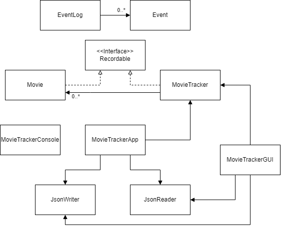

# Watched Movie Tracker
## App that keeps track of all the movies that you have watched!
I have always wanted to be able to easily keep track of the movies
that I have watched, ideally in a neat and simple application. 
I tend to forget what movies I have watched, and as such, it would be 
extremely handy to be able to create an app to keep track of this for me.

Anybody should be able to use this app, as a key aspect of it is 
that it will have a simple UI to ensure that no user is overwhelmed.

I am planning for the app to display the following information:
- **List of movie names** that the user has watched
- **Date** watched
- **Description** of each movie
- **Rating** out of 5 for each movie

## User Stories

- As a user, I want to be able to add a movie to my watched movie tracker list
- As a user, I want to be able to view a list of movie names that I have watched
- As a user, I want to be able to view what rating I gave a particular movie
- As a user, I want to be able to view what date I watched a particular movie
- As a user, I want to be able to view the description that I gave a particular movie
- As a user, I want to be able to update my entries
- As a user, I want to be able to save my movie tracker list to a file
- As a user, I want to be able to load my movie tracker list from file

# Usage instructions

- To start the GUI, navigate to the UI package, then run the MovieTrackerGUI file
- You can generate the first event (Adding a movie to the movie list) by filling in the movie name, rating,
date watched, and description, then clicking on the 'add movie' button. 
- You can generate the second event by clicking on each movie in the list on the left, after which you will
see that the parameter boxes on the right-hand side have been populated with the respective data. You can then change
the fields as you wish, then you can press 'update movie' to add the movie back to the list with the updated parameters.
- You can locate visual components by running the GUI, and then clicking any of the 4 buttons. If you click one of
the buttons on the left (save list or load list), you will be greeted with a popup message with a star. If you click
one of the buttons on the right (add movie or update movie), you will be greeted with a popup message of a tick.
- You can save the state of the application by clicking on the 'save list' button in the bottom left of the GUI.
- You can reload the state of the application by clicking on the 'load list' button in the bottom left of the GUI.

# Phase 4: Task 2
When adding a movie to the movie tracker:
- Fri Nov 25 10:54:03 PST 2022
- Added a movie to the movie tracker.

When updating any of a movie's attributes in the movie tracker program:
- Fri Nov 25 10:54:36 PST 2022
- Name of movie set to: Finding dory.
- Fri Nov 25 10:54:36 PST 2022
- Rating of movie set to: 5.
- Fri Nov 25 10:54:36 PST 2022
- Date of movie set to: 22nd july 2021.
- Fri Nov 25 10:54:36 PST 2022
- Description of movie set to: About a blue fish.

# Phase 4: Task 3

Possible ways to improve the design:
- I could combine the MovieTrackerConsole and the MovieTrackerGUI in order to improve cohesion and reduce coupling.
- I could also create, throw, and catch more exceptions to make my methods more robust.
